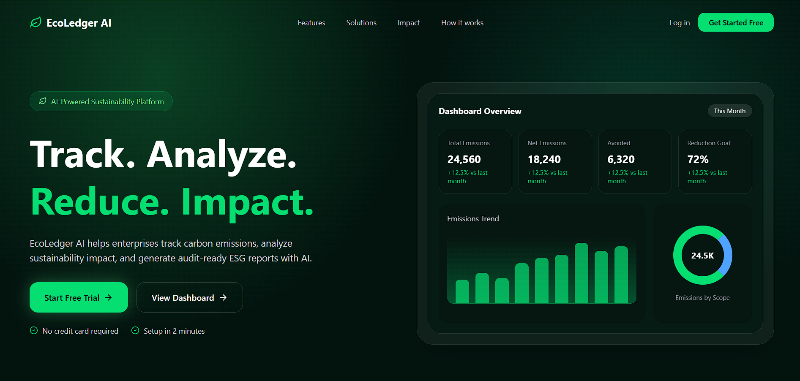
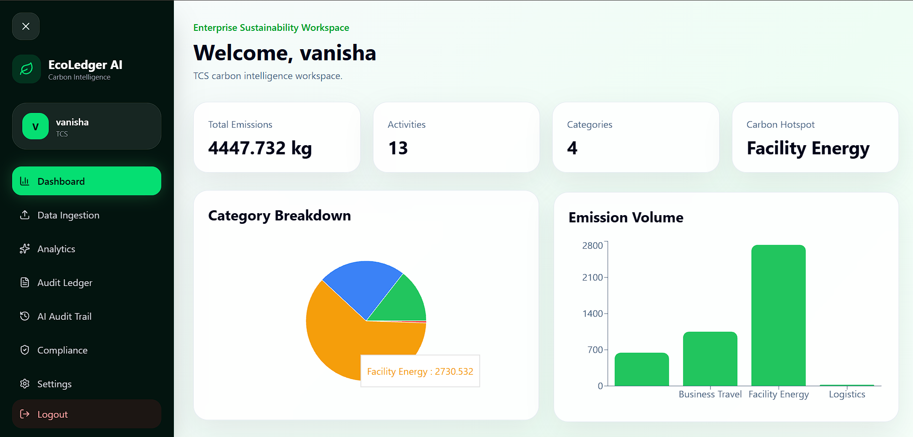
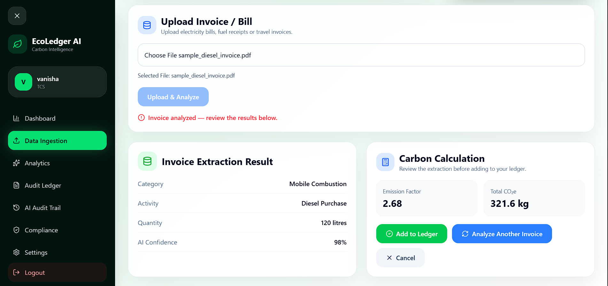
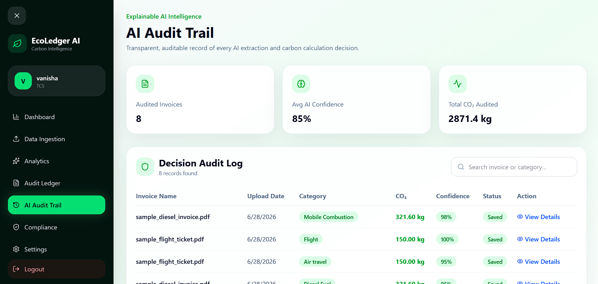
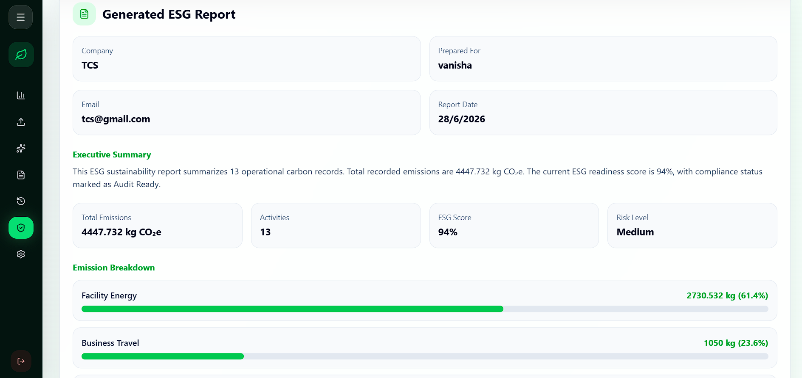

# 🌱 EcoLedger AI – Enterprise AI-Powered ESG Carbon Intelligence Platform

EcoLedger AI is a full-stack AI-powered ESG (Environmental, Social & Governance) and Carbon Accounting platform that helps organizations automate carbon footprint tracking from operational data and invoices.

The platform combines AI-powered document understanding, carbon accounting, auditability, analytics, and ESG reporting into a single enterprise-grade solution.

---

## 🚀 Features

### 🔐 Authentication
- JWT Authentication
- Secure Login & Signup
- User-specific dashboards
- Protected API routes

---

### 📄 AI Invoice Processing

Upload invoices or bills in PDF format.

The system automatically:

- Extracts text using PdfReader
- Uses Google Gemini AI to understand invoice content
- Identifies:
  - Category
  - Activity
  - Quantity
  - Unit
- Maps emission factors
- Calculates CO₂ emissions
- Allows user verification before saving

Supported document types:
- ✅ Electricity Bills
- ✅ Flight Tickets
- ✅ Diesel Invoices (Extensible)
- More document types can be added easily.

---

### ✍ Manual Carbon Entry

Users can manually enter:

- Activity
- Quantity
- Category

The platform calculates CO₂ emissions instantly.

---

### 🤖 AI-Assisted Carbon Calculation

Instead of manually calculating emissions, EcoLedger AI automatically:

Invoice
↓

AI Extraction

↓

Emission Factor Lookup

↓

CO₂ Calculation

↓

User Review

↓

Save to Ledger

---

### 📊 Carbon Analytics Dashboard

Interactive dashboard with:

- Total Carbon Emissions
- Monthly Trends
- Category-wise Distribution
- Carbon Insights
- ESG Metrics
- Live Charts

---

### 📚 Audit Trail (Explainable AI)

Every AI decision is fully traceable.

Each uploaded document stores:

- Original invoice
- Extracted text
- AI structured output
- Emission factor used
- Carbon calculation
- Timestamp
- User information

Users can inspect exactly how every CO₂ value was generated.

---

### 📑 ESG Reporting

Generate enterprise-ready ESG reports including:

- Total emissions
- Category-wise breakdown
- Carbon trends
- Sustainability insights

Reports are downloadable as PDFs.

---

### 🔍 Explainable AI

EcoLedger AI is designed to be transparent.

Instead of simply showing a CO₂ value, the platform explains:

Invoice

↓

Extracted Text

↓

AI Interpretation

↓

Emission Factor

↓

Final Carbon Calculation

This creates an auditable carbon accounting workflow.

---

## 🏗 System Architecture

```
                        ┌────────────────────┐
                        │    React Frontend  │
                        └─────────┬──────────┘
                                  │
                           REST API Calls
                                  │
                        ┌─────────▼──────────┐
                        │   Express Backend   │
                        └─────────┬──────────┘
                                  │
             ┌────────────────────┼────────────────────┐
             │                    │                    │
             ▼                    ▼                    ▼
      JWT Authentication     PDF Reader         Google Gemini AI
             │                    │                    │
             └──────────────┬─────┴────────────────────┘
                            ▼
                 AI Structured Extraction
                            │
                            ▼
               Emission Factor Knowledge Base
                            │
                            ▼
                  Carbon Calculation Engine
                            │
                            ▼
                     MongoDB Database
                            │
      ┌─────────────────────┼────────────────────┐
      ▼                     ▼                    ▼
    Ledger              Documents          Audit Trail
                            │
                            ▼
                Analytics • ESG Reports • Dashboard
```

---

## 🛠 Tech Stack

### Frontend

- React.js
- Tailwind CSS
- React Router
- Context API

### Backend

- Node.js
- Express.js
- MongoDB
- Mongoose
- JWT Authentication

### Artificial Intelligence

- Google Gemini API
- PdfReader

### Database

- MongoDB Atlas

### Deployment

- Frontend → [EcoLedger AI](https://ecoledger-ai-1.onrender.com)
- Backend → Render
- Database → MongoDB Atlas

---

## 📂 Project Structure

```
EcoLedger-AI
│
├── backend
│   ├── config
│   ├── middleware
│   ├── models
│   ├── routes
│   ├── services
│   ├── uploads
│   └── server.js
│
├── frontend
│   ├── public
│   ├── src
│   │   ├── assets
│   │   ├── components
│   │   ├── context
│   │   ├── pages
│   │   └── App.jsx
│   └── package.json
│
└── README.md
```

---

## ⚙ Installation

### Clone Repository

```bash
git clone https://github.com/vanishar9880/EcoLedger-AI.git

cd EcoLedger-AI
```

---

### Backend Setup

```bash
cd backend

npm install

npm run dev
```

---

### Frontend Setup

```bash
cd frontend

npm install

npm run dev
```

---

## 🔑 Environment Variables

Create a `.env` file inside the backend folder.

```
PORT=5000

MONGO_URI=YOUR_MONGODB_URI

JWT_SECRET=YOUR_SECRET

GEMINI_API_KEY=YOUR_GEMINI_API_KEY
```

---

## 📸 Screenshots

### Landing Page



---

### Dashboard



---

### AI Invoice Processing



---

### Audit Trail



---

### ESG Report


---

## 🌟 Key Highlights

- AI-powered invoice understanding
- Automated carbon accounting
- Explainable AI workflow
- Secure JWT authentication
- User-specific carbon ledgers
- Interactive ESG analytics
- Audit-ready document trail
- PDF-based invoice ingestion
- Enterprise-inspired architecture
- Modular backend for future RAG integration

---

## 🚧 Future Roadmap

- OCR for scanned invoices
- AI ESG Assistant
- Retrieval-Augmented Generation (RAG)
- Vector Database Integration
- Company Benchmarking
- Multi-tenant Organization Support
- Email Reports
- Real-time Carbon Alerts
- Role-Based Access Control
- Cloud Deployment

---

## 📈 Resume Highlights

This project demonstrates experience with:

- Full-Stack Web Development
- REST API Design
- Authentication & Authorization
- MongoDB Database Design
- AI Integration using Google Gemini
- Document Processing Pipelines
- Carbon Accounting Logic
- Explainable AI
- ESG Reporting
- Enterprise SaaS Architecture

---

## 👩‍💻 Author

**Vanisha Rathore**

B.Tech – Electronics & Communication Engineering

Netaji Subhas University of Technology (NSUT)


## ⭐ If you found this project interesting, consider giving it a Star!
